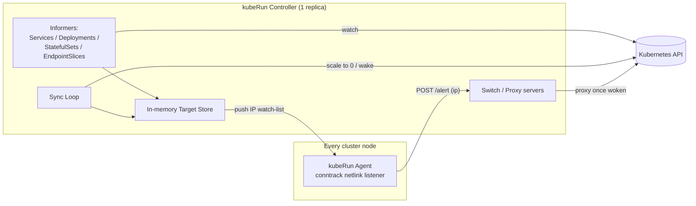

# kubeRun

**kubeRun** is a scale-to-zero operator for Kubernetes. It watches your Services, puts idle
workloads to sleep (0 replicas), and wakes them back up the instant real traffic arrives — all
without requiring any changes to your application code, and without relying on an HTTP-level
sidecar or ingress proxy.

Instead, kubeRun detects traffic at the kernel level using **conntrack** (Linux connection
tracking), which means it works for any TCP traffic your Service receives — HTTP, gRPC, raw TCP,
database connections, anything — not just requests that pass through a specific proxy layer.

---

## Why conntrack instead of a proxy?

Most scale-to-zero tools (e.g. Knative, KEDA's HTTP add-on) work by routing all traffic through an
HTTP proxy that can observe request volume. That's effective, but it means:
- Every request pays a proxy hop, even when the workload is already awake.
- Non-HTTP protocols usually aren't supported out of the box.

kubeRun instead asks the Linux kernel directly: "has this destination IP seen a new connection?"
via netlink conntrack events. This is nearly free at runtime when a workload is awake (no proxy in
the path), and only kicks in a temporary proxy ("switch") while a workload is asleep and needs to
be woken.

---

## Architecture at a glance

kubeRun has two components:

| Component | Runs as | Responsibility |
|---|---|---|
| **Agent** | DaemonSet (one per node, `hostNetwork: true`) | Watches kernel conntrack events, matches destination IPs against a watch-list, and alerts the controller on a hit. |
| **Controller** | Deployment (single replica) | Watches Kubernetes Services/Deployments/StatefulSets, decides what to track, scales workloads to zero when idle, and wakes them on demand. |



---

## The Agent

The agent is a privileged DaemonSet (`NET_ADMIN`, `SYS_ADMIN`) that runs on every node with
`hostNetwork: true`. Its job is narrow and cheap:

1. **Listen to the kernel.** It opens a netlink `conntrack` connection and subscribes to
   `GroupCTNew` (new connections), optionally also `GroupCTUpdate` if
   `agent.config.update: true` is set (needed if you want kubeRun to also react to renewed
   activity on already-established long-lived connections, at the cost of more events to filter).
2. **Filter.** For every connection event, it checks the destination IP against a watch-list held
   in memory (`store.Config.Ips`). This list is the set of ClusterIPs (or headless-service keys)
   the controller currently cares about.
3. **Alert.** On a match, it `POST`s the IP (or its headless-service equivalent, from
   `HeadlessMap`) to the controller's `/alert` endpoint.
4. **Stay in sync with the controller**, two ways at once:
   - **Slow path:** the watch-list lives in a mounted ConfigMap
     (`/etc/agent-config/config.yml`), watched via `fsnotify`. Any update to the ConfigMap is
     picked up automatically.
   - **Fast path:** the controller also pushes individual IP updates directly over HTTP to
     `:4443/update` on every agent pod as soon as a new Service is registered, so there's no
     multi-minute delay waiting for the ConfigMap to propagate.

## The Controller

The controller is intentionally a **single replica** with no leader election — its state
(in-memory port allocations, target map, live proxy servers) is not shared or persisted, so
running more than one replica would cause conflicting scale decisions.

### What it tracks

The controller uses Kubernetes informers to watch Services labeled `kuberun/run: "true"` across
**all namespaces**, plus their backing Deployments, StatefulSets, Pods, and EndpointSlices. For
each matched Service it resolves the real workload behind it (walking Pod → ReplicaSet →
Deployment, or Pod → StatefulSet directly) and stores a `TargetDto` keyed by:
- the Service's `ClusterIP`, for normal ClusterIP services, or
- `svc-<name>`, for headless services (StatefulSets), since those have no ClusterIP to key on.

Two special cases are excluded automatically: the controller's own Service/Deployment (so it
never tries to scale itself) and anything backed by a DaemonSet (agents included).

### Shadow services and the wake path

When a target goes idle past its threshold (see [Timing](#timing) below), the controller doesn't
touch the workload's Pods directly — it goes through a **shadow service** pattern:

1. A "shadow" copy of the user's Service is created in kubeRun's own namespace, with its ports
   pointed at per-port **Switch** HTTP servers running inside the controller.
2. The real Deployment/StatefulSet is scaled to 0 replicas.
3. The user's original Service is patched to `ExternalName`, pointing at the shadow service's DNS
   name. Traffic to the original Service now transparently lands on a Switch.
4. The first request that hits a Switch triggers `ScaleUp()`: the workload is scaled back to 1
   replica, the controller waits for a Pod to report `Ready`, then re-patches the proxy
   destination and the original Service back to `ClusterIP`/normal routing. The in-flight request
   is held (via a lock) until the Pod is ready, then proxied through — so the caller sees a delayed
   response rather than a dropped connection.

Switch ports are allocated from a small in-memory bitmap (ports 200–60000, with `:4444` reserved
for the controller's own alert listener) and released back to the pool when a target is deleted.

### Headless services

StatefulSets typically sit behind headless Services (`clusterIP: None`), which have no single IP
to key on. kubeRun instead watches the Service's `EndpointSlice` and tracks each Pod's individual
IP, mapping every one of them to the same `svc-<name>` key via the agent's `headless_map`. This is
what lets the agent translate "traffic hit pod IP X" back into "target `svc-<name>` is active."

### Timing

`controller.syncMinutes` (default 15, configurable) doesn't mean what it sounds like — the actual
idle threshold is:

```
store.SyncTime = syncMinutes * time.Minute / 2
```

So the default `syncMinutes: 15` scales a workload to zero after **~7.5 minutes** of no observed
traffic, checked once per `SyncTime` tick by the sync loop.

---

## Labels

kubeRun coordinates state entirely through labels (see `labels.md` for the full reference):

| Label | Values | Purpose |
|---|---|---|
| `kuberun/operator` | `controller`, `agent`, `shadow` | Marks a kubeRun-owned resource |
| `kuberun/run` | `"true"` | Opts a Service (and its backing workload) into kubeRun management |
| `kuberun/key` | ClusterIP or `svc-<name>` | Where this Service's tracked state lives |
| `kuberun/clusterIP` | an IP | Recorded on the Deployment/StatefulSet so it can be re-associated after resource lookups |

---

## Observability

kubeRun uses structured logging (`log/slog`, JSON by default) across both binaries, configurable
via `LOG_LEVEL` (`debug`/`info`/`warn`/`error`) and `LOG_FORMAT` (`json`/`text`) environment
variables.

All handled errors carry a stable `KRxxxxx`-style code documented in `errors.md`, which maps to
a severity tier:

| Severity | Meaning | Log level | Behavior |
|---|---|---|---|
| `H` | Unrecoverable | `slog.Error` | Logged, then panics |
| `M` | Recoverable | `slog.Warn` | Logged, execution continues |
| `L` | Benign/transient | `slog.Debug` | Logged at debug only, no alarm |

If you hit an error code in the logs, `errors.md` will tell you exactly what component, category,
and severity it maps to.

---

## Installation

kubeRun ships as a Helm chart at `charts/kuberun`:

```bash
helm install kuberun ./charts/kuberun
```

To install into a non-default namespace, `--namespace` and `--set namespace=...` must match —
this is enforced by the chart, because the namespace is a single source of truth threaded through
the ClusterRoleBinding subject, the agent ConfigMap, and every relevant env var. See
`charts/kuberun/README.md` for the full values reference.

**Important operational constraints:**
- Run exactly **one** controller replica — there is no leader election.
- The controller's RBAC is intentionally **cluster-scoped** (it needs to watch and scale
  workloads in any namespace that opts in via labels), even though the controller itself lives in
  one namespace.
- The agent DaemonSet requires `hostNetwork: true` and the `NET_ADMIN`/`SYS_ADMIN` capabilities to
  read conntrack events — these are not optional.

---

## Project layout

```
agent/        Go module — the DaemonSet binary (conntrack listener + filter + alert client)
controller/   Go module — the Deployment binary (informers, scaling, shadow services, switches)
charts/kuberun/  Helm chart for installing both components
k8s/          Raw manifests the Helm chart was derived from
errors.md     Full KRxxxxx error code reference
labels.md     Full kuberun/* label reference
versions.md   Per-component changelog
```

---

## Status

kubeRun is under active development — see `versions.md` for the detailed changelog of what's
landed in the agent and controller so far.

## License
kubeRun is licensed under the [Apache License 2.0](LICENSE).
